# Minagi Alarm ✦

> [简体中文](README.zh.md) · [English](README.md)

洗練されたエレガントなデスクトップ目覚まし時計——**アラーム、タイマー、クロックモード、デスクトップモード**——すべてをひとつに。

**Tauri v2**（React + Rust）で構築、軽量で美しく、すぐに使えます。
**Windows 10** および **Windows 11** に対応しています。

---

## ✨ 特徴

- 🕐 **アラーム** —— 複数のアラームを設定可能。カスタム着信音、カスタムメモ、異なる繰り返し曜日の指定に対応
- ⏳ **タイマー** —— プリセットおよびカスタムのカウントダウン時間、カスタム着信音とカスタムリマインダーテキストに対応
- 🎵 **カスタム着信音** —— `mp3 / wav / ogg / flac / m4a / aac` をインポート可能。内蔵の精緻なデフォルト音色も多数
- 🖼️ **クロックモード** —— コンパクトで洗練された時計表示。ドラッグ＆リサイズ可能。複数の付箋を追加して内容を自由にカスタマイズ。ミュージックプレイヤー内蔵、インポートした音楽の再生とシャッフル再生に対応
- 🪟 **デスクトップモード** —— ウィンドウをデスクトップに埋め込み、マウススルーに対応。トレイアイコンを右クリックしてデスクトップモードを終了
- 🌐 **多言語対応** —— 简体中文 · 繁體中文 · English · 日本語 の4つのインターフェース言語に対応
- 🎨 **テーマカラー** —— テーマカラーを自由に変更可能。マウスに追従する桜の花びらエフェクト
- 🖼️ **カスタム背景** —— カスタム背景画像に対応。マウスパララックス追従
- 🪟 **ウィンドウ透明度** —— ソフトウェアUIとデスクトップモードで独立した透明度設定
- 🖱️ **システムトレイ** —— システムトレイ常駐に対応。トレイアイコンの右クリックメニューでクイック操作
- 🚀 **パフォーマンス** —— インストーラ約6MB、Tauri v2 + Rust ベース、瞬時起動

---

## 📖 使い方

| 操作 | 説明 |
|:---|:---|
| 🕐 **アラーム追加** | アラームタブで「追加」をクリック、時刻・着信音・繰り返しルールを設定 |
| ⏳ **タイマー** | タイマータブに切り替え、プリセットまたはカスタム時間を選択 |
| 🎨 **テーマカラー変更** | 設定ページでテーマカラー見本をクリックしてお好みの色に |
| 🖼️ **背景画像** | 設定ページで背景画像を選択、透明度・拡大率・オフセットを調整 |
| 🌸 **桜エフェクト** | 設定ページで桜エフェクトを有効化、数・色・透明度を調整 |
| 🖥️ **クロックモード** | 時刻表示をダブルクリック、または起動ページをクロックモードに設定 |
| 📝 **付箋** | クロックモードで空白領域を右クリックして付箋を追加。ドラッグで位置調整 / ダブルクリックで編集 / ピンを右クリックで削除またはMarkdownエクスポート |
| 🎵 **BGM** | クロックモードで時計をダブルクリックしてミュージックプレイヤーを開く。シャッフル再生に対応 |
| 🪟 **デスクトップモード** | タイトルバーのボタンをクリック、またはトレイメニューからデスクトップモードに移行。トレイアイコンを右クリックして終了 |
| 🗣️ **言語切り替え** | 設定ページで言語を選択。简体中文 · 繁體中文 · English · 日本語 に対応、即座に反映 |

---

## 🖼 スクリーンショット

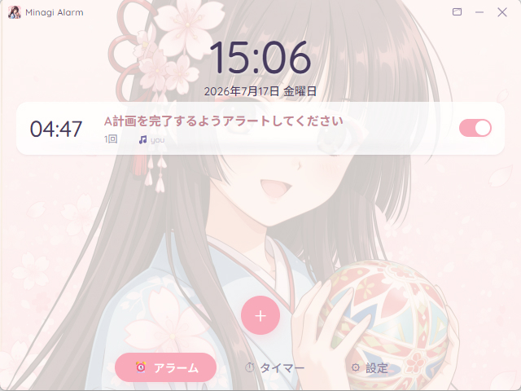

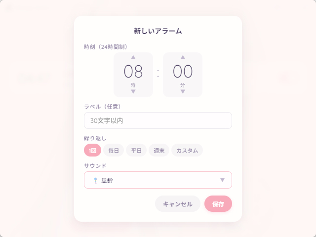

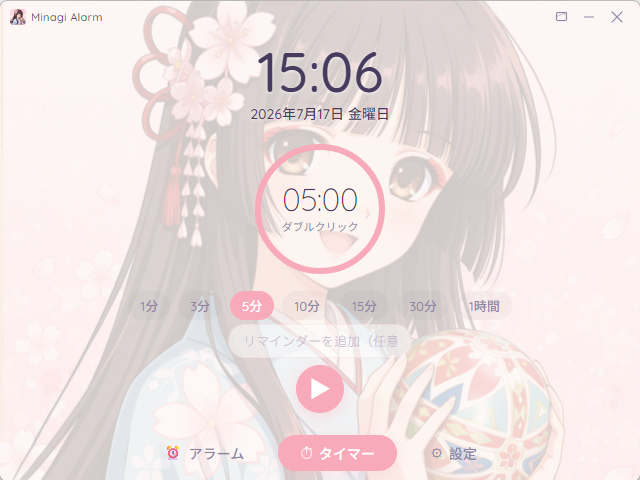

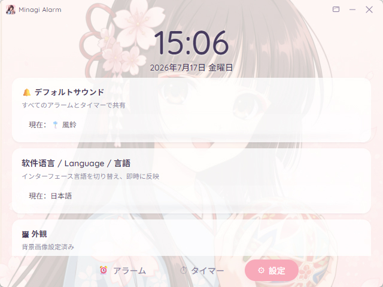

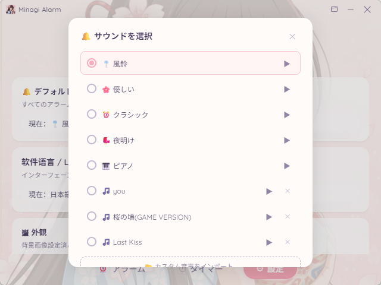

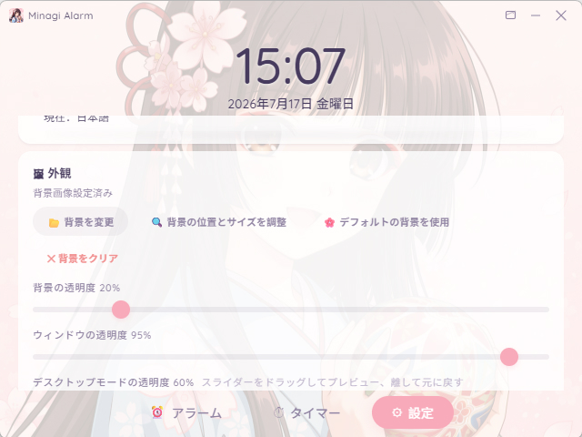

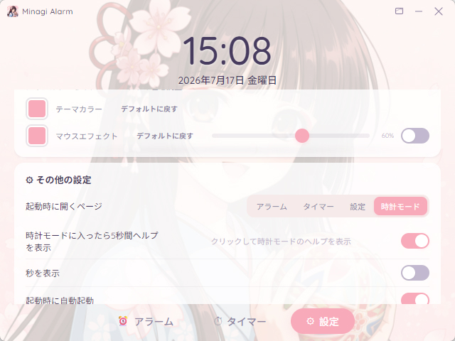

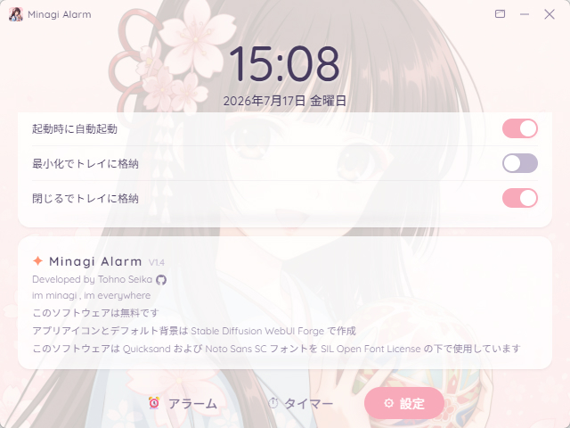

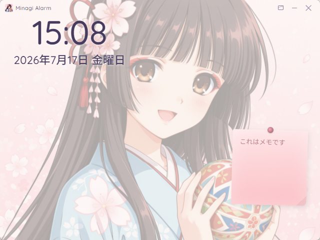

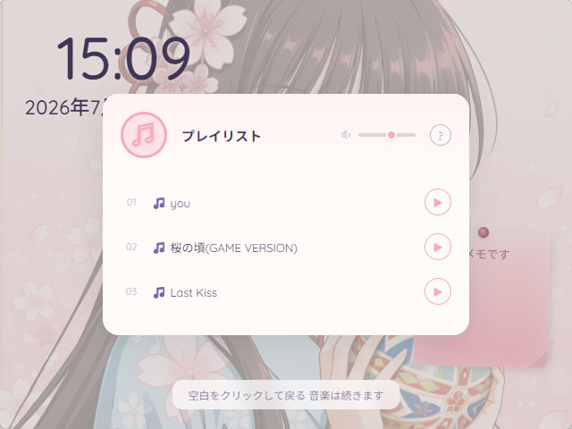

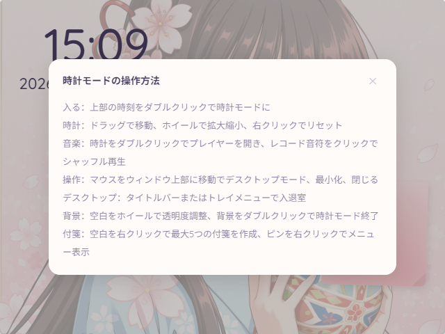

---

## 📦 ダウンロード

[Releases](https://github.com/TohnoSeika/minagi-alarm/releases) ページから最新のインストーラをダウンロードしてください。

> 💡 現在のバージョン **v1.4.0**、インストーラ約6MB。Windows版はNSISセットアッププログラムです。

---

## 📋 更新履歴

詳細は [CHANGELOG.md](./CHANGELOG.md) をご覧ください。

### v1.4.0
1. Electron から Tauri アーキテクチャに移行。
2. 壁紙モードをデスクトップモードに名称変更。
3. 多言語インターフェースに対応: 简体中文 · 繁體中文 · English · 日本語.
4. アーキテクチャ移行に伴う多数のUIおよび機能の問題を解決。
5. 多数のUIおよび機能の最適化とバグ修正。

### v1.3.0
1. 壁紙モード（現デスクトップモード）を追加。
2. 自動起動機能を追加。
3. 多数のUIおよび機能の最適化とバグ修正。

### v1.2.0
1. クロックモードで起動するオプションを追加。
2. 秒表示の切り替えを追加。
3. 「背景透明度」を「背景画像透明度」、「インターフェース透明度」を「ウィンドウ透明度」に名称変更。
4. マウスエフェクト透明度スライダーにホバー時に「マウスエフェクト透明度」と表示。
5. 「閉じる」の説明から「（終了しない）」を削除。
6. 桜マウスエフェクトをデフォルトでオフに変更。
7. タイマー開始時、リマインダーテキストがない場合はリングを中央寄りに配置。
8. クロックモードに付箋機能を追加、関連機能を完善。
9. クロックモードにミュージックプレイヤーを追加、関連機能を完善。
10. デフォルトで起動する機能画面を選択可能に。
11. プレイヤーの音量調節機能を追加。
12. 多数のバグを修正、多数の機能を改善。
13. 多数のUIおよび機能の最適化とバグ修正。

### v1.1.0
1. クロックモードを追加——時刻と背景画像のみを表示。
2. 多数のUIおよび機能の最適化とバグ修正。

### v1.0.0
基本機能を完了。

---

## 🤖 AI アシスタンス

本プロジェクトのコードおよびUIデザインの一部は、AIの支援を受けて作成されました。

---

## 📜 ライセンス

本プロジェクトは **フリーソフトウェア** です。すべての権利は留保されています。
詳細は [LICENSE](./LICENSE) · [LICENSE.zh](./LICENSE.zh) · [LICENSE.ja](./LICENSE.ja) をご覧ください。

---

> 本ソフトウェアは無料であり、いかなる料金も請求しません。
> Developed by Tohno Seika
