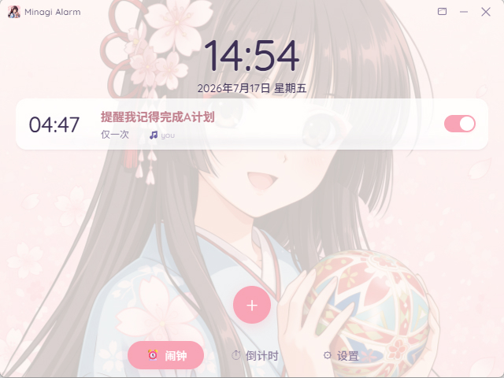
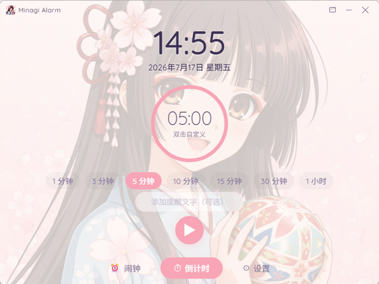
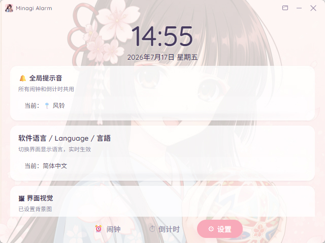
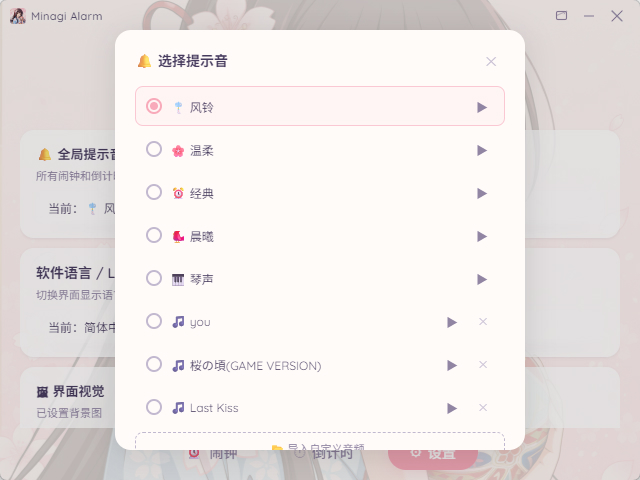
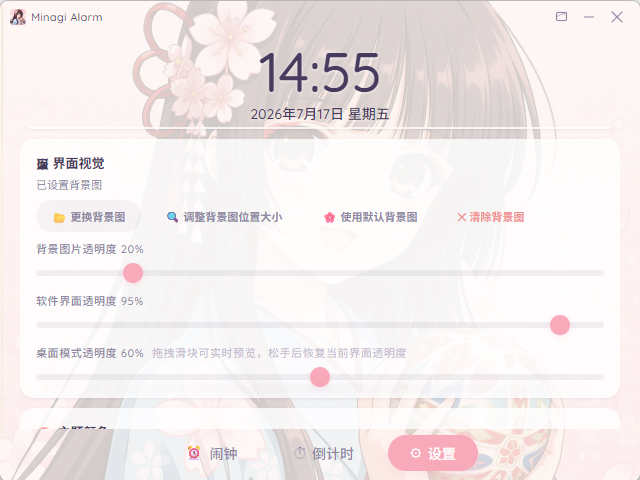
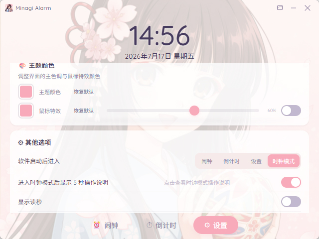
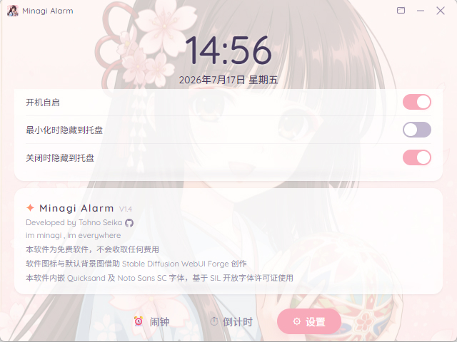
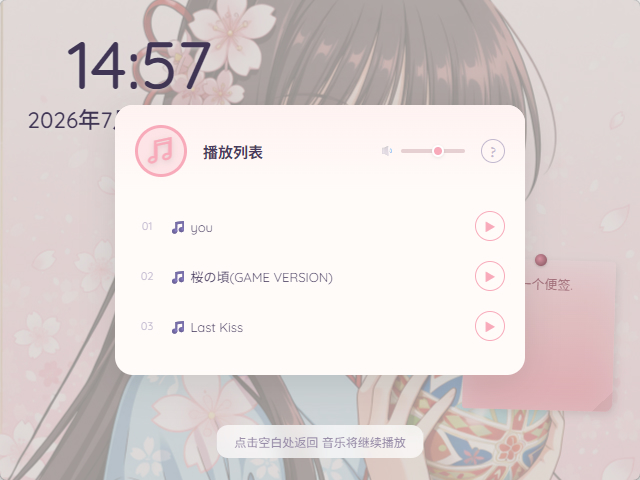
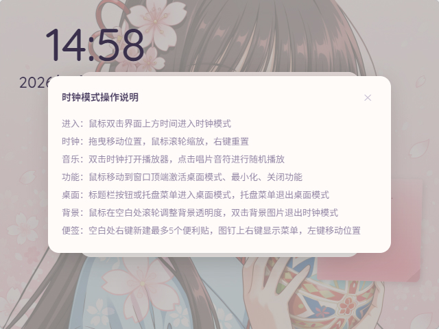

# Minagi Alarm ✦

> [English](README.md) · [日本語](README.ja.md)

一个精致、优雅的桌面闹钟应用——**闹钟、倒计时、全屏时钟、桌面模式**，一应俱全。

基于 **Tauri v2** 构建，React + Rust，轻量、漂亮、开箱即用。
软件支持 **Windows 10** 和 **Windows 11** 系统。

---

## ✨ 特性

- 🕐 **闹钟** —— 支持设置多组闹钟，支持自定义铃声,自定义闹钟备注与设定不同的重复周期
- ⏳ **倒计时** —— 支持预设和自定义倒计时时间，支持自定义铃声和支持自定义提醒文字
- 🎵 **自定义铃声** —— 导入 `mp3 / wav / ogg / flac / m4a / aac`，内置多种默认精致铃音
- 🖼️ **时钟模式** —— 小巧精致的时钟模式，可拖拽和缩放时间显示，支持添加多个便利贴并自定义便利贴内容,内置音乐播放器,支持播放导入的自定义音乐,支持随机播放模式
- 🪟 **桌面模式** —— 支持将窗口嵌入桌面，支持鼠标穿透. 进入桌面模式后右键托盘图标退出桌面模式
- 🌐 **多语言** —— 支持 简体中文 · 繁體中文 · English · 日本語 四种界面语言
- 🎨 **主题配色** —— 支持自由更换主题色，支持鼠标樱花飘落特效
- 🖼️ **自定义背景** —— 支持自定义背景图片,支持鼠标视差跟随
- 🪟 **窗口透明度** —— 支持软件界面与桌面模式透明度独立调节
- 🖱️ **系统托盘** —— 支持系统托盘驻留，支持托盘图标右键快捷操作
- 🚀 **性能** —— 安装包约 6MB，基于 Tauri v2 + Rust，瞬时启动

---

## 📖 使用方法

| 操作 | 说明 |
|:---|:---|
| 🕐 **添加闹钟** | 在闹钟标签页点击「添加」，设置时间、铃声与重复规则 |
| ⏳ **倒计时** | 切换到倒计时标签页，选择预设或自定义时长 |
| 🎨 **更换主色** | 在设置页点击主题色块，选择喜欢的颜色 |
| 🖼️ **背景图片** | 设置页选择背景图片，调节透明度、缩放与偏移 |
| 🌸 **樱花特效** | 设置页开启樱花特效，调整个数、颜色与透明度 |
| 🖥️ **时钟模式** | 双击时间显示区域，或设置启动页为时钟模式 |
| 📝 **便利贴** | 时钟模式下右键空白区域添加便签，可拖拽位置, / 双击编辑 / 在图钉上右键删除便利贴或导出 Markdown文件 |
| 🎵 **背景音乐** | 时钟模式下双击时钟，打开音乐播放器，支持随机播放 |
| 🪟 **桌面模式** | 点击标题栏的按钮，或从托盘菜单进入桌面模式,从托盘图标右键菜单退出桌面模式 |
| 🗣️ **切换语言** | 设置页选择语言，支持简体中文 · 繁體中文 · English · 日本語 四种界面语言,设定后立即生效 |

---

## 🖼 截图

*01: 闹钟界面*

*02: 编辑闹钟*

*03: 倒计时界面*

*04: 设置界面1*

*05: 设置界面2*

*06: 设置界面3*

*07: 设置界面4*

*08: 设置界面5*

*09: 时钟模式界面*

*10: 时钟模式音乐播放器*

*11: 时钟模式帮助文件*

---

## 📦 下载

从 [Releases](https://github.com/TohnoSeika/minagi-alarm/releases) 页面下载最新版本的安装包即可。

> 💡 当前版本 **v1.4.0**，安装包约 6MB。Windows 安装包为 NSIS 安装程序。

---

## 📋 更新记录

### v1.4.0
1. 从Electron迁移到Tauri架构.
2. 壁纸模式更名为桌面模式.
3. 支持多语言界面 : 简体中文 繁體中文 English 日本語.
4. 解决大量因架构迁移而导致的界面和功能问题.
5. 大量界面和功能优化和BUG修复..

### v1.3.0 
1. 新增壁纸模式.
2. 新增开机自启功能.
3. 大量界面和功能优化和BUG修复.

### v1.2.0 
1. 添加软件以时钟模式启动的选项
2. 添加读秒显示开关.
3. "背景透明度"改为"背景图片透明度","界面透明度"改为"软件界面透明度"
4. 鼠标放在"鼠标特效透明度"调节条上时显示"鼠标特效透明度"文本.
5. 关闭时隐藏到托盘(不退出),把(不退出)删除
6. 默认关闭樱花鼠标特效.
7. 开始倒计时后,如果有备注,位置维持现状,没备注,圆环位置应该更偏中央.
8. 在时钟模式下添加便利贴,并完善相关功能.
9. 在时钟模式下添加音乐播放器,并完善相关功能.
10. 增加默认进入软件的功能选择.
11. 添加播放器音量调节功能.
12. 修复大量BUG,改进大量功能.
13. 大量界面和功能优化和BUG修复.

### v1.1.0
1. 增加时钟模式,仅展示时间和背景图片.
2. 大量界面和功能优化和BUG修复.

### V1.0.0
完成基础功能.

---

## 🤖 AI 辅助声明

本项目的部分代码及界面设计借助 AI 辅助完成。

---

## 📜 许可证

本项目为 **免费软件**，保留所有权利。
详情请参见 [LICENSE](./LICENSE)（英文）· [LICENSE.zh](./LICENSE.zh)（中文）· [LICENSE.ja](./LICENSE.ja)（日文）文件。

---

> 本软件为免费软件，不会收取任何费用。
> Developed by Tohno Seika
